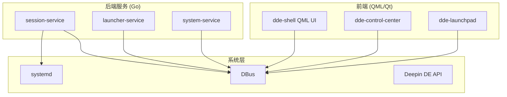
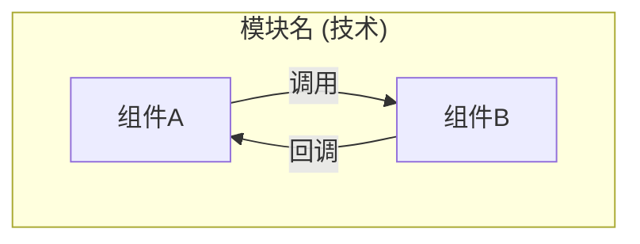
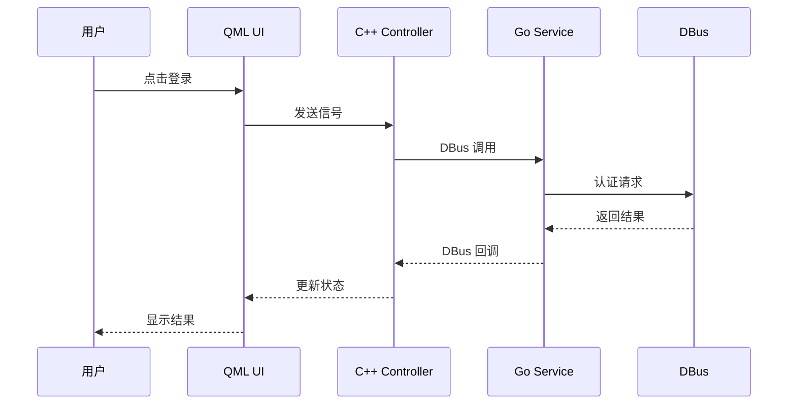
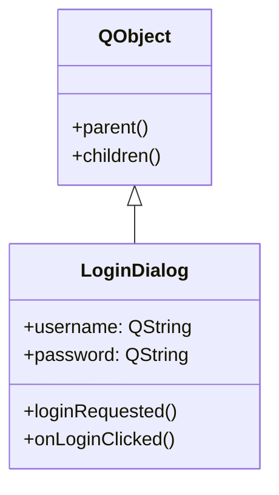

# DDE 项目 Wiki 操作详解

## INIT（初始化）工作流

首次设置 — 扫描代码库并构建初始 wiki：

### 1. 扫描代码库结构

```bash
# 识别目录结构
ls -la
find . -name "CMakeLists.txt" | head -20
find . -name "*.pro" | head -10
find . -name "go.mod" | head -10

# 识别语言
find . -name "*.cpp" -o -name "*.h" | wc -l
find . -name "*.qml" | wc -l
find . -name "*.go" | wc -l

# 识别构建配置
cat CMakeLists.txt
cat go.mod 2>/dev/null
```

识别内容：
- 语言：C++、QML、Go、Shell、Python
- 框架：Qt、QML
- 构建工具：CMake、qmake、go mod
- 目录约定：src/, include/, qml/, proto/, cmd/, pkg/, tests/, debian/

### 2. 读取现有文档

- README.md、README.zh_CN.md
- CLAUDE.md
- Qt 文档注释（.h 文件中的 /** */ 注释）
- 配置文件（CMakeLists.txt、go.mod、*.pro）
- Git 历史：`git log --oneline -30`

### 3. 编写 overview.md

```yaml
---
title: 项目概览
type: overview
created: YYYY-MM-DD
updated: YYYY-MM-DD
---
```

内容应包含：
- 项目用途和定位
- 技术栈概述
- 架构总览（含 mermaid 图）
- 子项目关系（如 dde-shell, dde-control-center, dde-launchpad 等）
- 目录结构说明
- 构建和部署信息
- 关键设计决策

Mermaid 架构图示例：


### 4. 创建实体页面

**C++ 类实体** `entities/cpp/<class-name>.md`：

```yaml
---
title: LoginDialog
type: entity
tags: [cpp, qt, dialog]
created: YYYY-MM-DD
updated: YYYY-MM-DD
related_files:
  - src/widgets/login-dialog.h
  - src/widgets/login-dialog.cpp
signals:
  - loginRequested(QString username)
  - loginFinished(bool success)
slots:
  - onLoginButtonClicked()
  - onCancelClicked()
inherits: QDialog
---
```

页面内容：
- 类的用途说明
- 主要功能和职责
- 信号槽说明
- 使用示例
- 依赖关系

**QML 组件实体** `entities/qml/<component-name>.md`：

```yaml
---
title: LauncherGrid
type: entity
tags: [qml, launcher, grid]
created: YYYY-MM-DD
updated: YYYY-MM-DD
related_files:
  - qml/launcher/LauncherGrid.qml
cpp_backend:
  - src/launcher/launchermodel.h
  - src/launcher/launchermodel.cpp
---
```

页面内容：
- 组件用途说明
- 属性和信号
- 使用方式
- 与 C++ 后端的交互

**Go 服务实体** `entities/go/<service-name>.md`：

```yaml
---
title: SessionService
type: entity
tags: [go, service, session]
created: YYYY-MM-DD
updated: YYYY-MM-DD
related_files:
  - cmd/session/main.go
  - pkg/session/service.go
  - pkg/session/handler.go
depends_on:
  - DBus
  - systemd
  - logind
exports:
  - DBus 接口: org.deepin.Session
---
```

页面内容：
- 服务用途说明
- DBus/API 接口
- 核心功能
- 依赖关系
- 配置选项

### 5. 创建概念页面

**概念页面** `concepts/<concept-name>.md`：

```yaml
---
title: Qt Signal/Slot 机制
type: concept
tags: [qt, pattern, communication]
created: YYYY-MM-DD
updated: YYYY-MM-DD
related_files:
  - src/core/signals.h
---
```

常见的概念页面：
- Qt Signal/Slot 模式
- QML 与 C++ 交互
- DBus 通信
- Go 服务架构
- 构建系统（CMake）
- 状态管理
- 事件处理流程

### 6. 创建 index.md 和 log.md

**index.md**：
```markdown
# DDE 项目 Wiki 索引

## 概览
- [项目概览](overview.md) — 架构和技术栈总览

## 概念
- [Qt Signal/Slot 机制](concepts/signal-slot-patterns.md) — 信号槽设计模式

## 实体

### C++ 组件
- [LoginDialog](entities/cpp/login-dialog.md) — 登录对话框组件

### QML 组件
- [LauncherGrid](entities/qml/launcher-grid.md) — 启动器网格视图

### Go 服务
- [SessionService](entities/go/session-service.md) — 会话管理服务

## Bug 分析
（暂无）

## 查询归档
（暂无）
```

**log.md**：
```markdown
# Wiki 操作日志

## [2026-04-21] init | 初始化项目 wiki
- 扫描代码库结构
- 创建 5 个实体页面，3 个概念页面
- 生成架构概览
```

---

## INGEST（代码变更摄入）工作流

### 1. 检测变更

**会话中变更**：跟踪当前任务中修改的文件

**会话开始时检测**：
```bash
# 获取上次 wiki 更新日期
grep "^## \[" wiki/log.md | tail -1

# 检查该日期后的变更
git diff --name-only --since="2026-04-15" HEAD
git log --oneline --since="2026-04-15"
```

### 2. 变更分类

| 变更类型 | Wiki 操作 |
|---------|----------|
| 新增 QObject 子类 | 创建 entity 页面到 entities/cpp/ |
| 新增 QML 组件 | 创建 entity 页面到 entities/qml/ |
| 修改 signals/slots | 更新 entity 页面，检查交叉引用 |
| 新增 DBus 服务 | 创建 entity 页面 |
| 新增 Go 包 | 创建 entity 页面到 entities/go/ |
| 修改 .proto 文件 | 更新 entity + 所有依赖实体 |
| CMakeLists.txt 变更 | 更新构建系统 concept 页面 |
| Qt 资源文件(.qrc)变更 | 更新相关 entity 页面 |
| 重命名文件/类 | 更新 entity 页面，修复所有引用 |
| 删除模块 | 删除 entity 页面，更新交叉引用 |

**琐碎变更（跳过）**：
- 格式化、代码风格调整
- 注释修改
- 测试数据更新
- 版本号修改
- 拼写错误修复

### 3. 更新流程

```markdown
1. 读取变更的文件
2. 理解变更对架构的影响
3. 更新相关 entity/concept 页面
4. 更新 overview.md（如有架构变化）
5. 更新 mermaid 图（如有流程变化）
6. 更新 index.md
7. 追加到 log.md
```

### 4. log.md 记录格式

```markdown
## [2026-04-21] ingest | 重构登录模块
- 触发：5 个文件在 src/widgets/login/ 变更
- 页面更新：entities/cpp/login-dialog.md, concepts/auth-flow.md
- 页面创建：entities/cpp/session-validator.md
- 影响页面数：4
```

---

## QUERY（查询）工作流

### 1. 查询流程

```markdown
1. 读取 index.md 找到相关页面
2. 读取 wiki 页面内容
3. 如需更多细节，读取源码
4. 综合回答，引用来源
5. 如有价值的综合分析，归档到 queries/
```

### 2. 回答格式

```markdown
根据 [登录流程](concepts/auth-flow.md)，登录验证分为以下步骤：

1. 用户输入凭证 → LoginDialog 收集
2. 调用 SessionService 验证（见 [SessionService](entities/go/session-service.md)）
3. 通过 DBus 返回结果

相关源码：
- src/widgets/login-dialog.cpp:145 — 收集用户输入
- pkg/session/auth.go:42 — 验证逻辑

注意：当前 wiki 可能未反映昨天的重构，建议检查 src/widgets/login/ 目录。
```

### 3. 归档有价值的查询

当查询产生有价值的综合分析时，创建 `queries/` 页面：

```yaml
---
title: 登录流程详细分析
type: query
tags: [auth, login, flow]
created: 2026-04-21
question: 用户登录的完整流程是怎样的？
related_files:
  - src/widgets/login-dialog.cpp
  - pkg/session/auth.go
---
```

---

## LINT（健康检查）工作流

### 1. 检查项目

**实体页面检查**：
- `related_files` 中的文件是否还存在？
- 是否有主要源文件缺少对应的 entity 页面？
- 类描述是否与当前代码行为一致？

**概念页面检查**：
- 模式描述是否仍然准确？
- 流程是否有变化？
- mermaid 图是否正确？

**概览页面检查**：
- 技术栈是否当前？
- 架构描述是否准确？
- 目录结构是否最新？

**交叉引用检查**：
- 所有 wikilinks 是否有效？
- 是否有孤立页面（无入站链接）？
- 是否有高频引用的实体缺少独立页面？

### 2. 检查脚本示例

```bash
# 检查 entity 页面引用的文件是否存在
grep -r "related_files:" wiki/entities/ | \
  sed 's/.*- //' | \
  while read f; do [ ! -f "$f" ] && echo "缺失: $f"; done

# 检查 wikilinks
grep -roh '\[\[[^]]*\]\]' wiki/ | sort -u
```

### 3. log.md 记录

```markdown
## [2026-04-21] lint | 代码库同步检查
- 过时引用：entities/cpp/old-service.md 引用已删除文件
- 未文档化：src/services/new-feature.cpp 无 entity 页面
- 过时图表：auth 流程图缺少新的 OAuth 步骤
- 已修复：删除过时引用，创建 new-feature 存根
- 需关注：auth 流程图需要人工审核
```

---

## FILE_ANALYSIS（分析归档）工作流

### 1. 判断归档价值

**值得保存**：
- 问题根因分析
- 修复方案和实现思路
- 代码流程/架构分析
- 性能问题诊断

**不值得保存**：
- 简单的文件定位问题
- 已有文档覆盖的内容
- 无需记录的临时调试

### 2. 检查 PMS 关联

- 用户提供了 bug 编号（如 PMS-12345）→ 记录到 `pms` 字段
- 用户提供了链接 → 记录到 `pms_url` 字段
- 用户未提供 → 不记录关联信息

### 3. 创建 Bug 分析页面

`bug-analysis/<bug-name>.md`：

```yaml
---
title: 登录界面偶发性卡死问题
type: bug-analysis
tags: [bug, login, freeze, threading]
created: 2026-04-21
status: fixed
related_files:
  - src/widgets/login-dialog.cpp
  - src/core/auth-handler.cpp
pms: PMS-12345
pms_url: https://pms.deepin.com/bug/PMS-12345
---
```

页面内容结构：

```markdown
## 问题描述
[用户报告的问题现象]

## 根因分析
[分析过程和发现的根本原因]

## 修复方案
[解决方案描述和关键代码改动]

## 影响范围
[可能受影响的其他模块]

## 验证方法
[如何验证问题已修复]

## 相关页面
- [[LoginDialog]]
- [[认证流程]]
```

### 4. 更新交叉引用

- 在相关 entity 页面添加 bug 引用
- 在相关 concept 页面添加注意事项
- 更新 index.md
- 追加到 log.md

### 5. log.md 记录

```markdown
## [2026-04-21] file_analysis | 登录界面卡死问题
- 创建：bug-analysis/login-freeze.md
- PMS: PMS-12345
- 关联实体：entities/cpp/login-dialog.md
- 关联概念：concepts/auth-flow.md
```

---

## Mermaid 图规范

### 架构图



### 流程图



### 类图



---

## 模板速查

### C++ 类模板

```yaml
---
title: 类名
type: entity
tags: [cpp, qt, 分类]
created: YYYY-MM-DD
updated: YYYY-MM-DD
related_files:
  - path/to/class.h
  - path/to/class.cpp
inherits: 父类名
signals:
  - signalName(type param)
slots:
  - slotName(type param)
---

简短描述类的用途。

## 主要功能

- 功能1
- 功能2

## 信号

### signalName(type param)
描述何时触发，携带什么信息。

## 槽

### slotName(type param)
描述何时被调用，做什么。

## 使用示例

```cpp
// 简单使用示例
```

## 依赖

- [[DependencyClass]]
- [[RelatedConcept]]
```

### QML 组件模板

```yaml
---
title: 组件名
type: entity
tags: [qml, 分类]
created: YYYY-MM-DD
updated: YYYY-MM-DD
related_files:
  - path/to/Component.qml
cpp_backend:
  - path/to/backend.h
  - path/to/backend.cpp
---

简短描述组件用途。

## 属性

| 属性 | 类型 | 说明 |
|------|------|------|
| propName | type | 描述 |

## 信号

### signalName
描述何时触发。

## 使用示例

```qml
Component {
    // 示例
}
```

## 后端交互

描述与 C++ 后端的数据交换方式。
```

### Go 服务模板

```yaml
---
title: 服务名
type: entity
tags: [go, service, 分类]
created: YYYY-MM-DD
updated: YYYY-MM-DD
related_files:
  - cmd/service/main.go
  - pkg/service/handler.go
depends_on:
  - 依赖1
  - 依赖2
exports:
  - DBus 接口: org.deepin.Service
---

简短描述服务用途。

## DBus 接口

### 方法

| 方法 | 参数 | 返回 | 说明 |
|------|------|------|------|
| MethodName | (args) | (rets) | 描述 |

### 信号

| 信号 | 参数 | 说明 |
|------|------|------|
| SignalName | (args) | 描述 |

## 配置

描述可配置选项。

## 依赖

- [[DependencyService]]
```

### Bug 分析模板

```yaml
---
title: Bug 简短描述
type: bug-analysis
tags: [bug, 相关模块]
created: YYYY-MM-DD
status: open | fixed | wontfix
related_files:
  - 相关源文件
pms: PMS-XXXXX              # 可选
pms_url: https://...        # 可选
---

## 问题描述

用户报告的问题现象。

## 根因分析

分析过程和发现的根本原因。

## 修复方案

解决方案描述。

```cpp
// 关键代码改动
```

## 影响范围

可能受影响的其他模块。

## 验证方法

如何验证问题已修复。

## 相关页面

- [[RelatedEntity]]
- [[RelatedConcept]]
```
